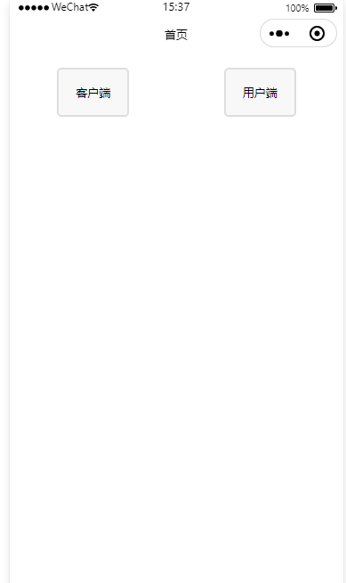

## CustomTabBar

> 基于`微信小程序`的多权限自定义 TabBar 组件

## Demo 食用方法

1. clone repo 仓库代码，使用微信小程序开发工具打开



2.分为客户端&用户端两种角色权限，具体配置文件见

```
CustomTabBar/utils/tab-service.js
```

## 使用方法

拷贝项目中组件 custom-tab-bar，配置自己需要的 tabbar 权限文件即可，最终配置到 tab-service.js 文件中

## 注意事项

1. 由于目前的 tabbar 个数受小程序规则限制，所以最多只可以加载 5 个本地 tabbar
2. 请将所有 tabbar 配置到 app.json 中，才可以正常显示切换（微信小程序的问题，有了解原理的可以告知）
